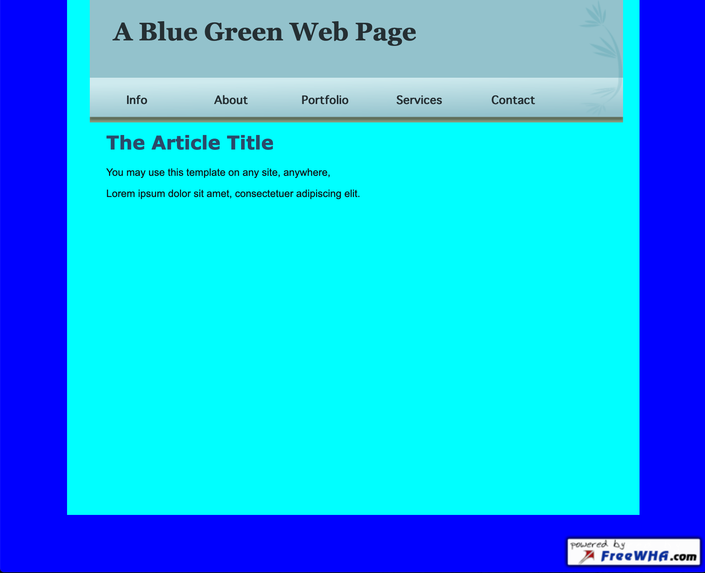

# Homework	3:	HTML	and	CSS	Exercise	

## Description	

- This website is composed by writing HTML and
CSS directly in a text editor to imitate the demo image. 
- The main page contains five active links “Info”, “About”, “Portfolio”,
    “services” and “Contacts” that link to different anchors of the second page.
- This image to imitate is as following.  

## Link to Website
- [Homework 3](http://mingyucu.freevar.com/hfro2nVP6b/index.html)