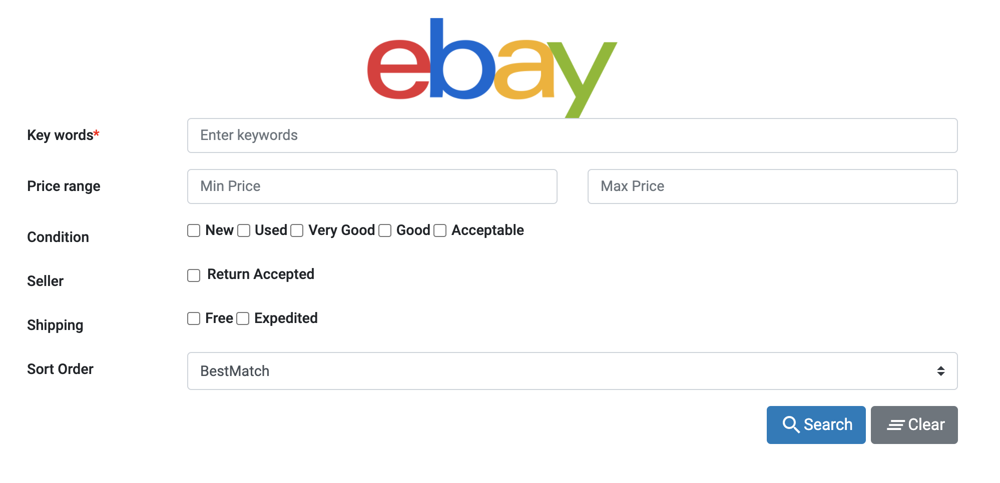
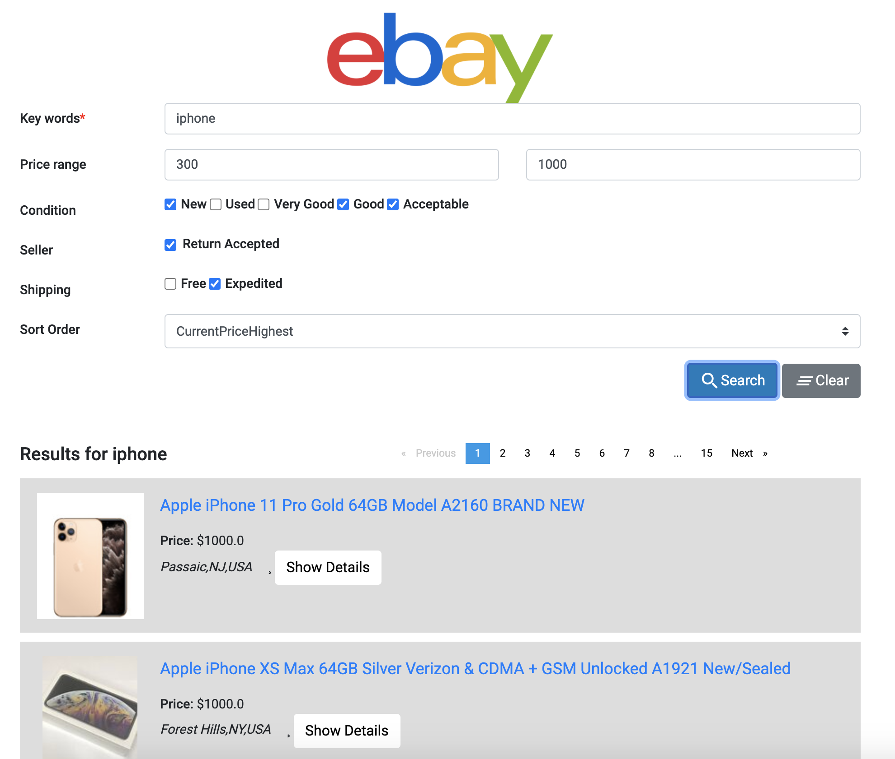
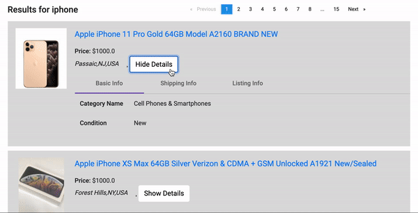
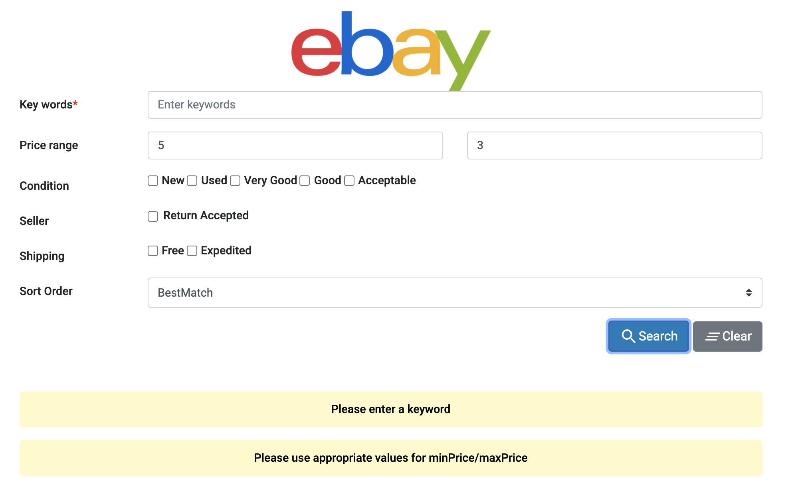

# Homework	8:	Ajax, JSON, Responsive Design and Node.js

## Link to Website
- [Homework 8](http://hw8-client-cs571su2020.wl.r.appspot.com)

## Description	

- The Homework 8 client is developed with the help of [Angular](https://angular.io/).  
- The user can enter keywords and filters for the product they are interested in.
  

- After clicking "Search", the result from eBay is displayed asynchronously. 
- Pagination is added to display the result in an organized manner. At most 5 items is displayed per page.

- The user can use the Show/Hide Detail button to see more/less about each product.

- If there is an error in the search fields, an error message is displayed.

- Responsive design is implemented to make sure display is adjusted to computer, tablet, and phone screen sizes.

## Angular CLI Commands
- Run `ng serve` for a dev server. Navigate to `http://localhost:4200/`. The app will automatically reload if you change any of the source files.
- Run `ng generate component component-name` to generate a new component. 
- Run `ng build` to build the project. The build artifacts will be stored in the `dist/` directory. Use the `--prod` flag for a production build.
