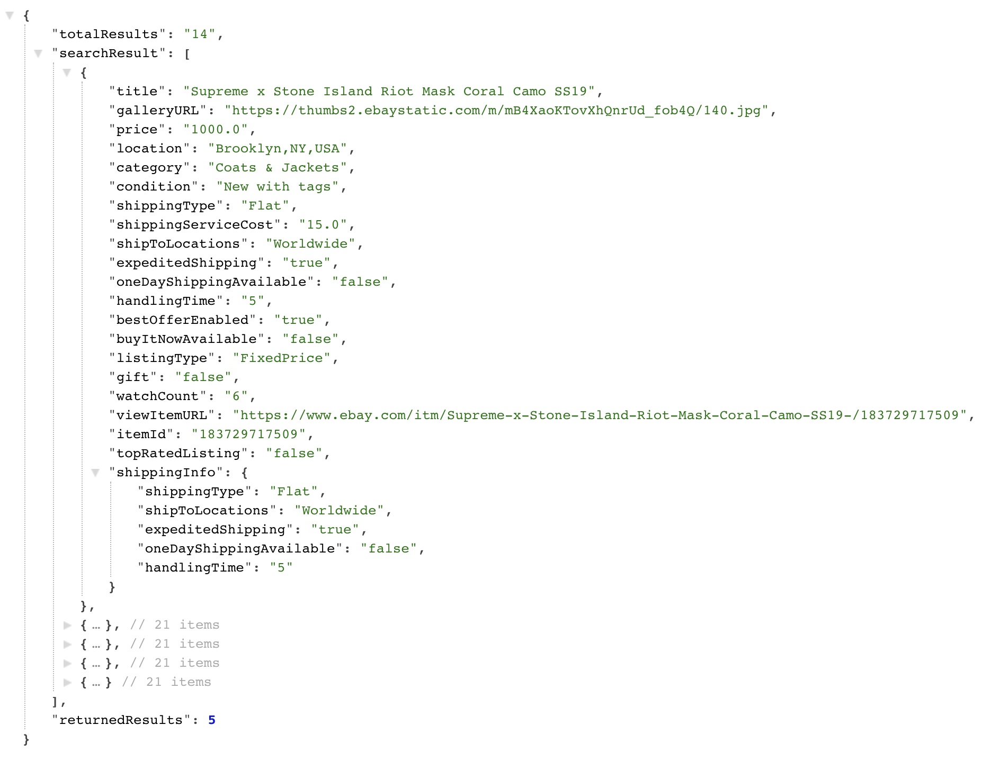
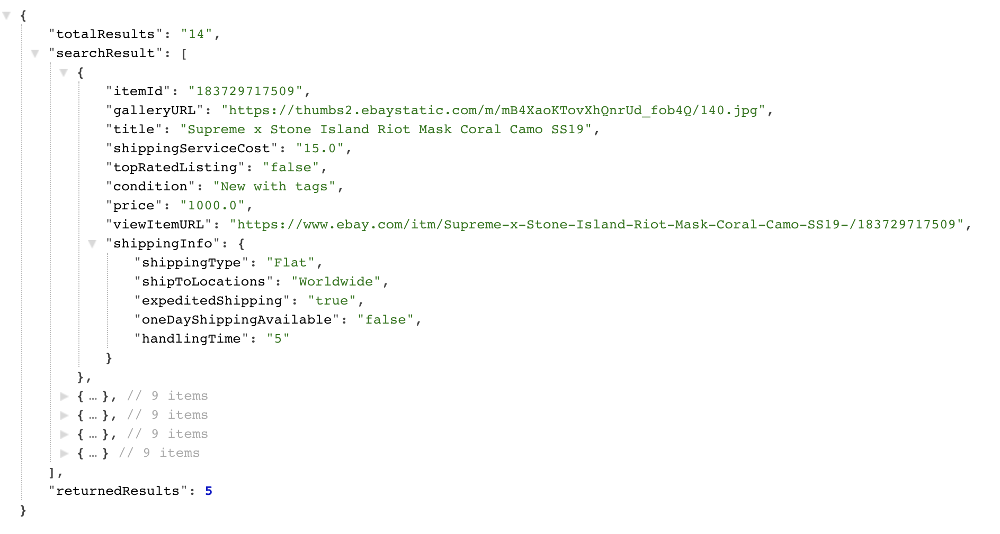
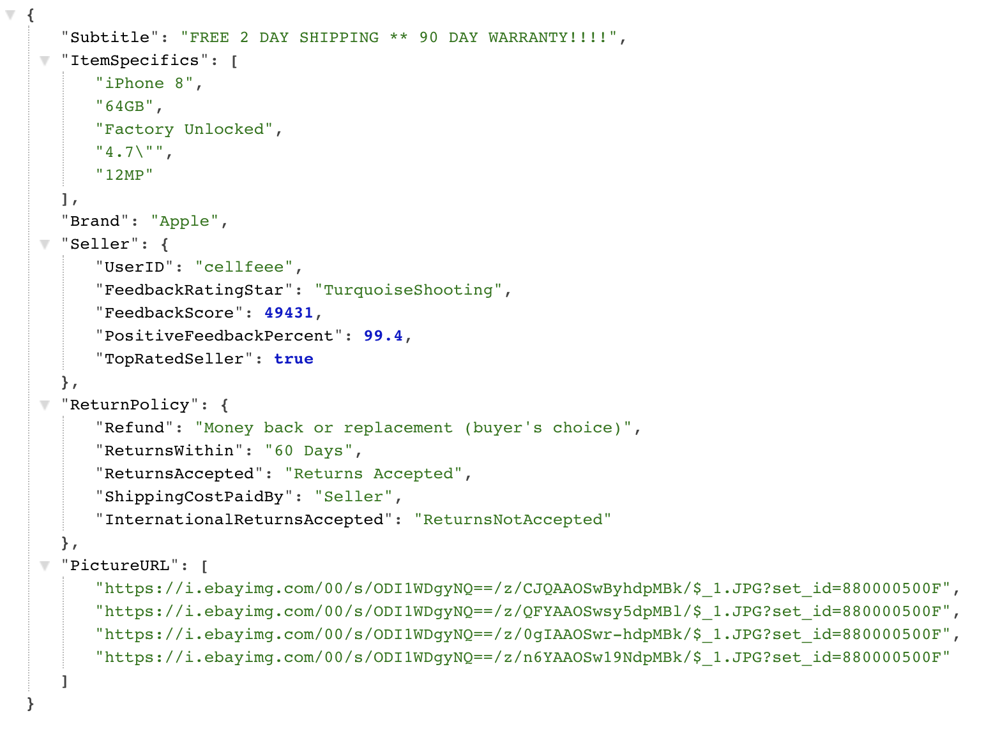

# Homework	8 and 9 Server

## Description	

- This is the server used for Homework 8 and Homework 9

## Endpoints
- /query: endpoint for Homework 8. GET method is required and the requirement of the query string is the same as [eBay's findItemsAdvanced API](https://developer.ebay.com/DevZone/finding/CallRef/findItemsAdvanced.html), except for the 'OPERATION-NAME', 'SERVICE-VERSION', 'SECURITY-APPNAME', 'RESPONSE-DATA-FORMAT', and 'REST-PAYLOAD' fields which are added by the server. After receiving the request, the server sends a GET request to eBay's findItemsAdvanced API and parses the received result, then JSON is returned to the user with up to 100 products.  
- Example: http://hw8-server-cs571su2020.wl.r.appspot.com/query?keywords=mask&sortOrder=PricePlusShippingHighest&itemFilter(0).name=MinPrice&itemFilter(0).value=1000%20&itemFilter(0).paramName=Currency&itemFilter(0).paramValue=USD&itemFilter(1).name=MaxPrice&itemFilter(1).value=1000&itemFilter(1).paramName=Currency&itemFilter(1).paramValue=USD&itemFilter(2).name=Condition&itemFilter(2).value=1000&itemFilter(3).name=ExpeditedShippingType&itemFilter(3).value=Expedited  

- /query_android: similar to /query but with updated JSON response for Homework 9. 
- Example: http://hw8-server-cs571su2020.wl.r.appspot.com/query_android?keywords=mask&sortOrder=PricePlusShippingHighest&itemFilter(0).name=MinPrice&itemFilter(0).value=1000%20&itemFilter(0).paramName=Currency&itemFilter(0).paramValue=USD&itemFilter(1).name=MaxPrice&itemFilter(1).value=1000&itemFilter(1).paramName=Currency&itemFilter(1).paramValue=USD&itemFilter(2).name=Condition&itemFilter(2).value=1000&itemFilter(3).name=ExpeditedShippingType&itemFilter(3).value=Expedited  

- /single/:itemID: additional endpoint for Homework 9. GET method is required and the requirement of the query string is the same as [eBay's GetSingleItem API](https://developer.ebay.com/devzone/shopping/docs/callref/getsingleitem.html) with itemID as input. After receiving the request, the server sends a GET request to eBay's GetSingleItem API and parses the received result, then JSON is returned to the user with detailed information of the product with corresponding ID.
- Example: https://hw8-server-cs571su2020.wl.r.appspot.com/single/253462854618

## Link to Website
- [Server Base URL](https://hw8-server-cs571su2020.wl.r.appspot.com/)