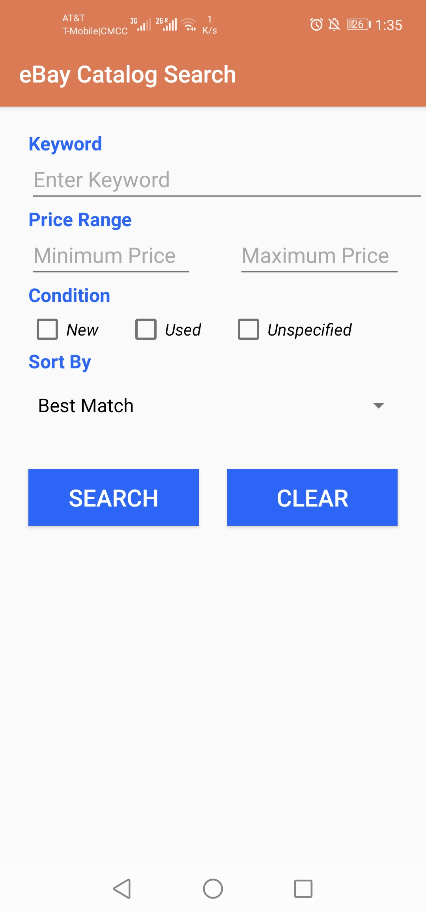
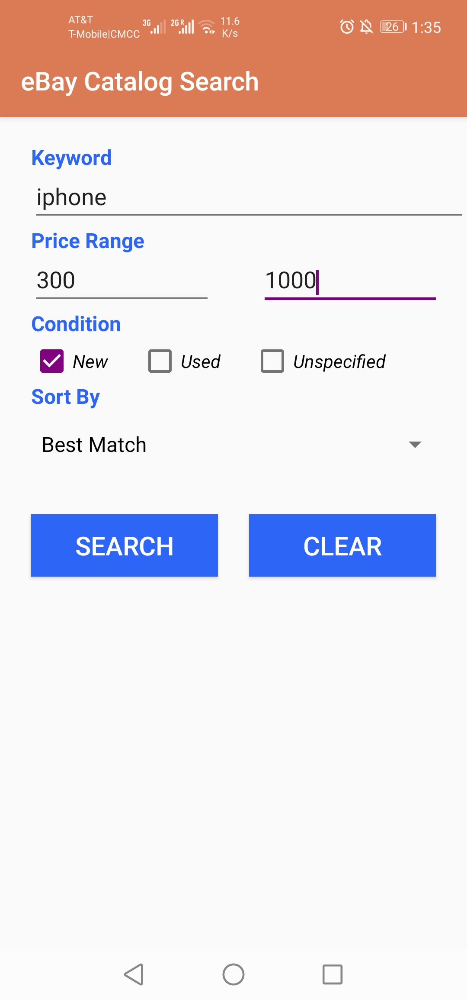
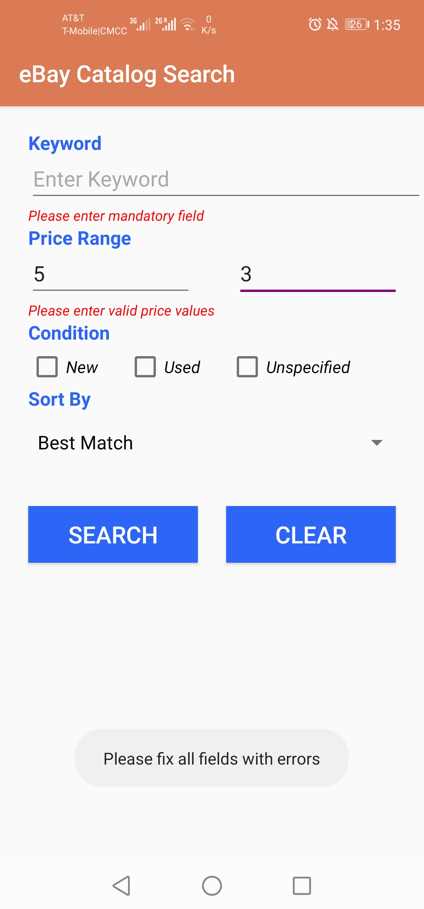

# Homework	9:	Android	App	for	eBay	Catalog	Search		

## Link to Google Play Store
- [Homework 9: Online Shopping Helper](https://play.google.com/store/apps/details?id=ebay.catalog.search)

## Description	

- Homework 9 client is developed in [Android Studio](https://developer.android.com/studio).  

  

- The user can enter keywords and filters for the product they are interested in.

  

- After clicking "Search", the result from eBay is displayed asynchronously. 
- Up to 50 products will be displayed in a GridView.
- The user can click on each product for more detail.

- If there is an error in the search fields, an error message is displayed.

